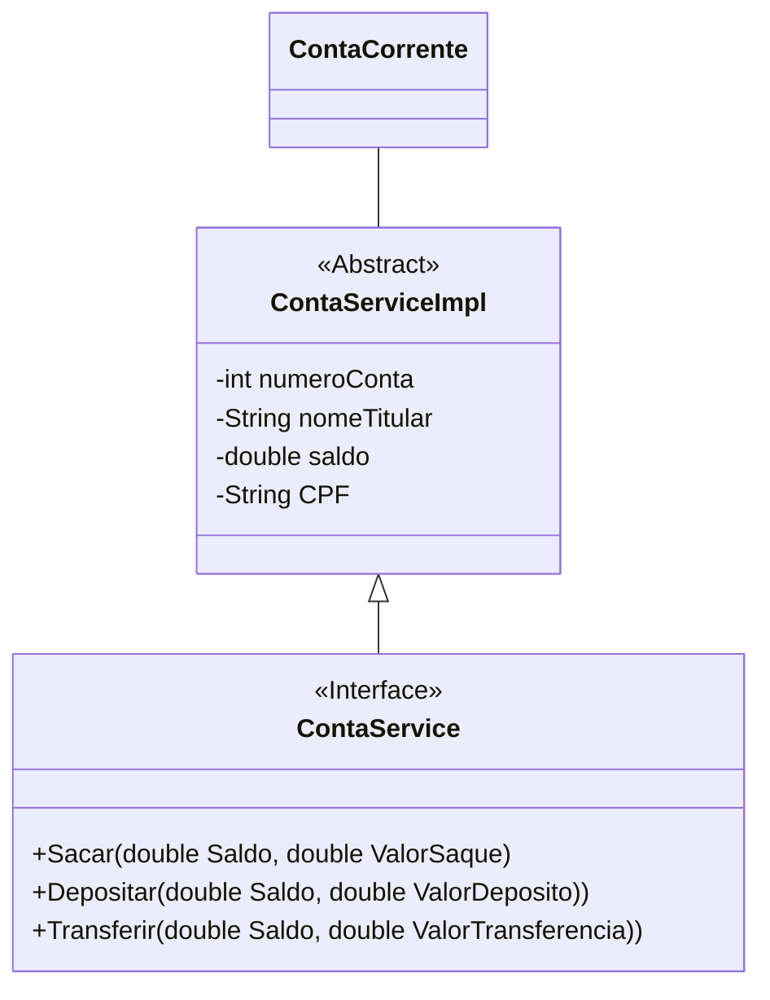

# LkBank

LkBank é um projeto colaborativo desenvolvido por **dois estudantes**, Kevin Richard (Desenvolvedor Júnior) e Lucy (Desenvolvedora Júnior), como parte de sua jornada de aprendizado em programação. O projeto é escrito em **Java** e segue os princípios do paradigma de **Orientação a Objetos (OO)**.

O principal objetivo deste projeto é consolidar e aplicar conhecimentos adquiridos em cursos das plataformas [Alura](https://www.alura.com.br/) e [Udemy](https://www.udemy.com/), servindo como base de estudos, prática e experimentação.

## 🎓 Sobre os Autores

- **Kevin Richard** – Estudante de Desenvolvimento de Software
- **Lucy** – Estudante de Desenvolvimento de Software

## 📚 Cursos Utilizados como Referência

- **Java OO:** Entendendo a Orientação a Objetos
- **Java Polimorfismo:** Entenda Herança e Interfaces
- **Java Exceções:** Aprenda a Criar, Lançar e Controlar Exceções
- **Java e java.lang:** Programe com as classes Object e String
- **Java e java.util:** Coleções, Wrappers e Lambda Expressions

## 🚀 Funcionalidades

- Depósito em conta
- Saque de valores
- Transferência entre contas

## 👨‍💻 Como Contribuir

. Faça um fork deste repositório: [LkBank](https://github.com/k3vinrich4rd/lk-bank)
. Crie uma branch para sua feature: `git checkout -b minha-feature`
. Faça commit das suas alterações: `git commit -m 'Adiciona nova feature'`
. Faça push para a branch: `git push origin minha-feature`
. Abra um Pull Request

## 📎 Links Úteis

- [Repositório no GitHub](https://github.com/k3vinrich4rd/lk-bank)
